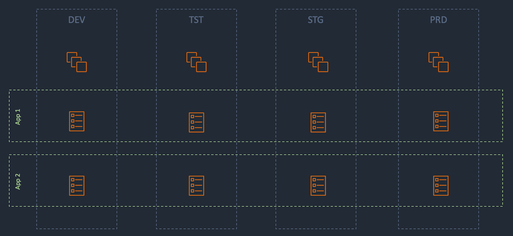
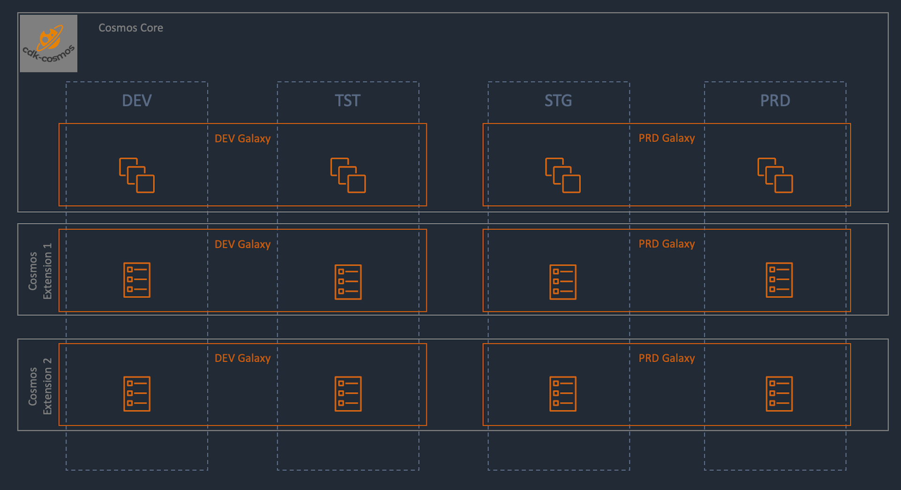
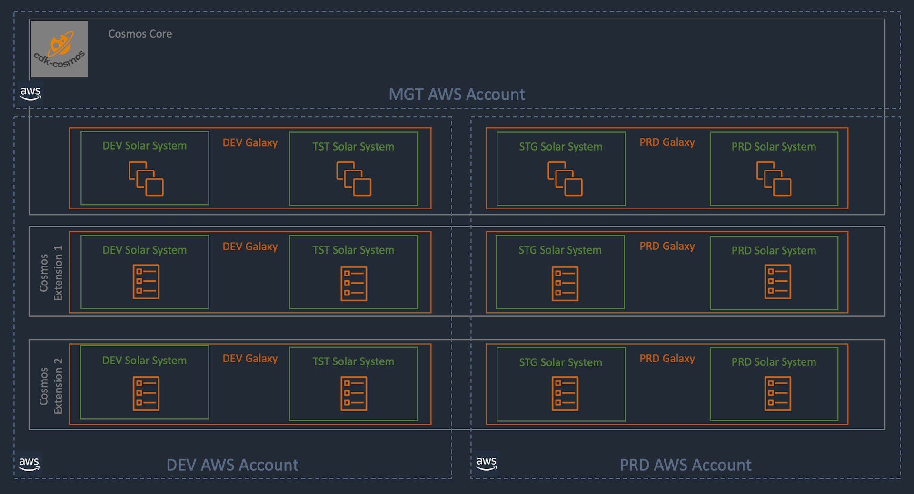

## Understanding the Cosmos

To fist understand the cosmos, we should first start with a basic enterprise architecture. Generally enterprise environments want to have isolated locations to deploy applications and services. These environments which we call App Envs or SolarSystems, are generally labelled dev, tst, stg, prd. As we move from left to right, the importance and severity of these applications and services increases. Thus we want to work out all the bugs before we deploy to Production, deploying lesser as we move from left to right. Out way of working should also reflect this, from Pipelines to Availability. The cosmos is centred around this design and idea.

### Basic Architecture

Lets start with a basic enterprise architecture. Here we can see that there are 4 app environments. In Each environment there are docker hosts and containers. The containers are owned by the Applications and the docker hosts are owned by shared infrastructure.

### Cosmos Architecture

In cosmos we can express the same idea with 5 Concepts, 2 (Core, Extension) owner constructs and 3 (Cosmos, Galaxy, SolarSystem) organisational constructs.

#### Owner Constructs

The owner constructs are ideas around who owns the aws infrastructure.

The Core is shared infrastructure. Things like Clusters and ALB's are resources that can be shared and applications (Extensions) can consume these resources.

An Extension is infrastructure owned by an "Application". Things like Containers, Code Repo and Databases are resources that shouldn't be shared and thus other applications should try to consume.

#### Organisational Constructs

The organisational constructs are ideas around organising resources, especially considering singleton resources and cross account resources.

The Cosmos is the root construct, that contains resources that you only want to create once and use though the cosmos (in Galaxies and SolarSystems). This is a concept that spans potentially across multiple AWS accounts (Galaxies), but due to limitations in AWS, resources created at this level are created only in your root AWS account, that we generally refer to as MGT Account.

The Galaxy is a construct that is 1:1 with aws accounts. Here you can create resources that are required for the account to function, or resourced that you might share at an account level to multiple SolarSystems.

The SolarSystem is a construct that defines individual "Deployment Application Environments". this is the lowest organisational construct that the Cosmos Supports. Here you can add Clusters (in the Core) and Containers (in the Extensions), etc. Each SolarSystem is designed to be conceptually isolated for each other, but in some cases for cost reasons they can share layers like networking.

The result of building the cosmos with multiple AWS accounts looks something like this.

